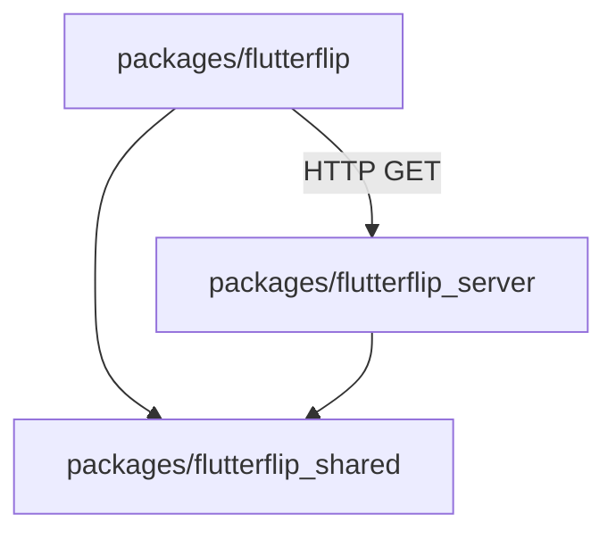
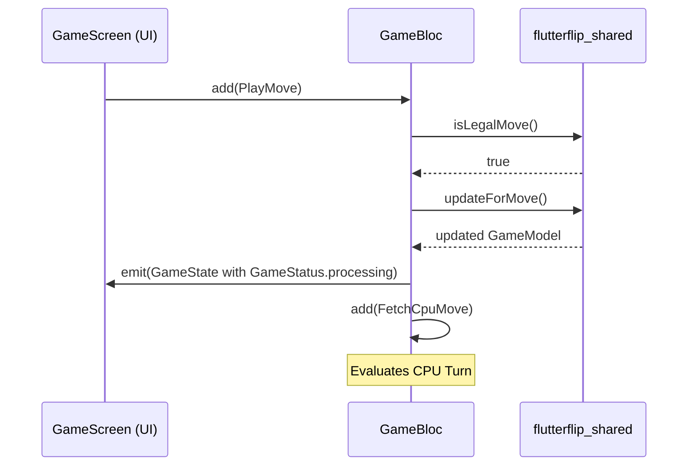

# FlutterFlip App Architecture Specification

This document details the software architecture, dependency layers, state management, and network communication patterns of the FlutterFlip application.

## 1. Monorepo Package Structure

The codebase is organized as a multi-package Dart/Flutter monorepo:

*   **`packages/flutterflip`**: The Flutter UI client app, housing screens, widgets, styling, and state logic.
*   **`packages/flutterflip_shared`**: The shared game logic containing models (`GameBoard`, `GameModel`) and the minimax algorithm (`move_finder.dart`). This package is shared between the Flutter client and the cloud functions server.
*   **`packages/flutterflip_server`**: A pure Dart server package utilizing the `firebase_functions` runtime, exposing an HTTP GET endpoint (`/get-move`) that runs the minimax algorithm.

---

## 2. Component Dependencies

The diagram below outlines the dependency flow between packages and modules:



### Key Client Dependencies
*   **`flutter_bloc`**: Manages state transitions and user inputs unidirectionally.
*   **`http`**: Used to communicate with the cloud functions server.
*   **`flutterflip_shared`**: Local path dependency providing board models and minimax fallback logic.

---

## 3. State Management (BLoC Pattern)

State management in the client is powered by the **BLoC (Business Logic Component)** library. The architecture separates the UI views ([main.dart](../lib/main.dart)) from the state-machine logic ([game_bloc.dart](../lib/bloc/game_bloc.dart)).



### 3.1 BLoC Events
All events inherit from the sealed class `GameEvent`:
*   `StartGame`: Resets the board and sets the active player to Black (Human).
*   `PlayMove(int x, int y)`: Dispatched when the human player taps a board cell.
*   `FetchCpuMove`: Dispatched internally to initiate CPU move calculations.

### 3.2 BLoC States
The `GameState` is immutable and contains:
*   `model`: The current `GameModel` from the shared package.
*   `status`: The current `GameStatus` enum:
    *   `readyForPlayer`: Human player's turn.
    *   `processing`: CPU calculation in progress.
    *   `complete`: Match finished (no moves remaining for either player).
*   `errorMessage`: An optional string detailing errors (e.g. server failure logging).

---

## 4. Networking & CPU Move Calculations

The CPU's turn is resolved using a fallback-oriented service architecture implemented in [move_finder_service.dart](../lib/services/move_finder_service.dart).

```mermaid
graph TD
    Start[Fetch CPU Move] --> Service[MoveFinderService]
    Service --> Remote{FirebaseFinderClient}
    Remote -- Success --> Return[Emit Next Move]
    Remote -- Network Failure / Empty URL --> Local[LocalFinderClient]
    Local --> Isolate[compute() on Background Isolate]
    Isolate --> Return
```

### 4.1 Remote Solver (`FirebaseFinderClient`)
Queries the cloud functions server using a `GET` request. 
*   **Endpoint**: Provided via the `SERVER_URL` Dart environment define.
*   **Parameters**: Passes `board`, `player`, and `depth` as query parameters.
*   **Timeout**: Set to **15 seconds**.

### 4.2 Local Solver Fallback (`LocalFinderClient`)
If the server is offline or fails, the app falls back to local execution.
*   **UI Thread Protection**: The minimax computation is CPU-bound and can block the UI thread.
*   **Isolate Execution**: The local finder uses Flutter's `compute()` function to run the minimax algorithm on a background CPU isolate, keeping the UI at 60/120fps.
